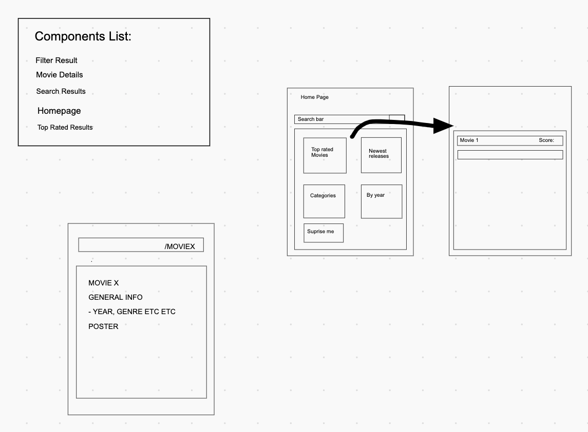
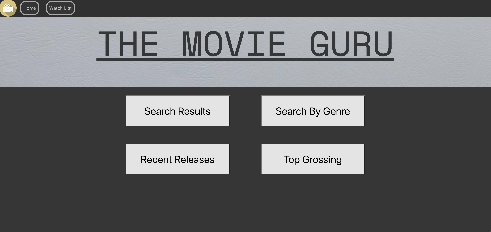
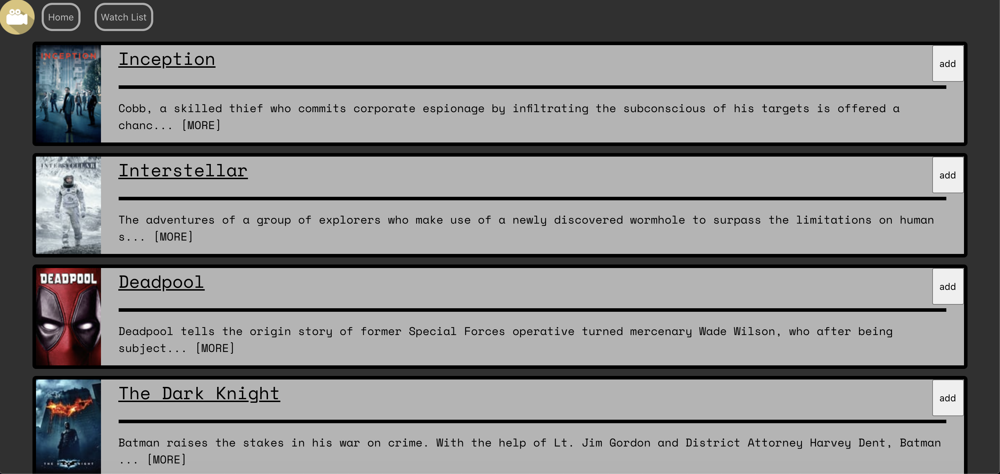

# Movie Guru
Made by [Sean Fenelon](https://github.com/seanfenelon) and [Adam Lee Osgood](https://github.com/adwam12)

## Overview:
The Movie Guru is a global index for both big budget and small indie films. Created over a week and a half with a single partner for and during the General Assembly Immersive Software Engineering Course.

We had decided to create a single place to find information for any movie, add them to a watchlist, and get movie recomendations.

Link: https://adwam12.github.io/project-2/

## Project requirements:
* Create React application
* Must use at least 1 public API
* Include a router
* Include several components
* Deployed online

## Technologies Used:
* JavaScript (ES6)
* HTML5 & CSS3
* Insomnia
* GitHub Pages
* Git
* React
* The APi: https://www.themoviedb.org/documentation/api

## Development:
### Teamwork:
Having never worked on a team programming project, we had to find an effective way to communicate our ideas, and make sure we shared a similar vision for the final product. Using a whiteboard website was essential:

### APIs and Filtering:
 We found an API that seemed perfect for our needs. tmdb (The Movie Database) had built in search filtering endpoints. The meant that with the proper code, we could modify the string of the fetch URL depending on user input (buttons in this case).
 The way a search filter worked was two folds.
	 First we created a function that would tell us the appropriate base URL to modify for a call:
		
	
	function runNewSearch(str) {
	
	if (searchFor === 'movies') {
	  baseString = "https://api.themoviedb.org/3/search/movie?api_key=c2d70a0194571a28181621f60f9b11c4&language=en-US&page=1&include_adult=false&query=Narnia"
	}
	if (searchFor === 'people') {
	  baseString = "https://api.themoviedb.org/3/search/person?api_key=c2d70a0194571a28181621f60f9b11c4&language=en-US&page=1&include_adult=false&query=John"
	}
	const address = baseString
	const newAddress = address.split('&')
	
	newAddress[newAddress.length - 1] = 'query=' + str
	baseString = newAddress.join().replaceAll(',', '&')
	
	}

Now that we had a base string to modify, we needed the code to modify it based on the user input:

    <button className={movieActive} id='filterButton' onClick={() => {
      setPeopleActive('inactive')
      setMovieActive('active')
      if (searchFor === 'people') {
        changeSearchParameter('movies')
        setSearchFor('movies')
      }

    }}>Movies</button>
    <button className={peopleActive} id='filterButton' onClick={() => {
      setMovieActive('inactive')
      setPeopleActive('active')
      if (searchFor === 'movies') {
        changeSearchParameter('people')
        setSearchFor('people')
      }

    }}>People</button>

### The Watchlist:
Most of the information we wanted could be fetched through the API, but to create a watchlist, we somehow had to carry information from one page to another without having our own backend. We implemented this by using local storage to store an array that would contain the ID number of every movie a user had added:

          {props.elem.release_date ?           
          <button className='AddToWishList' onClick={() => {
            console.log(props.elem.id)
            if (!localStorage.getItem('MovieWishList')) {
              localStorage.setItem('MovieWishList', JSON.stringify([]))
            }
            let test = JSON.parse(localStorage.getItem('MovieWishList'))
            test.push(props.elem.id)
            console.log(test)
            localStorage.setItem('MovieWishList', JSON.stringify(test))
          }}>{inWishlist}</button> : <h2></h2>}

## Wins and Takeaways:
* My partner and I both learned to effectively communicate ou ideas, and learned to code as a team.
* Being able to format and paginate any results pulled from the API
* Learning to work with React and components was very rewarding

## Future features:
* On the individual movie card, posters are stretched depending on screen size
* Clean up the design

## Challenges:
* Finding the right API
* Working as a team
* Watchlist feature
* Splitting work
* Pagination

## Screenshots:

